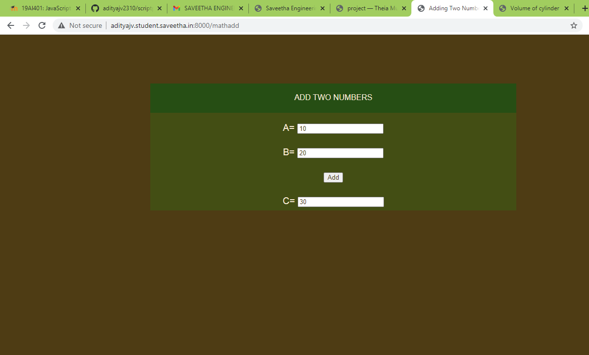

# Mathematical Calculations using JavaScript
## AIM:
To design a website to calculate the add two numbers and volume of a cylinder using JavaScript.

## DESIGN STEPS:
### Step 1: 
Requirement collection.
### Step 2:
Creating the layout using HTML and CSS.
### Step 3:
Write JavaScript to perform calculations.
### Step 4:
Choose the appropriate style and color scheme.
### Step 5:
Validate the layout in various browsers.
### Step 6:
Validate the HTML code.
### Step 6:
Publish the website in the given URL.

## PROGRAM:

### mathadd.html
~~~

<!DOCTYPE html>
<html>

<head>
    <title>Adding Two Numbers</title>
    <link rel="stylesheet" href="">
</head>

<body>
    

        

            

                ADD TWO NUMBERS
            

            

                <form action="" method="GET">
                    
                    

                        <label for="value_a">A=</label>
                        <input type="text" name="value_a" id="value_a">
                    

                    

                        <label for="value_b">B=</label>
                        <input type="text" name="value_b" id="value_b">
                    
                    
                    

                        <button type="button" name="button_add" id="button_add">Add</button>
                    

                    

                        <label for="value_c">C=</label>
                        <input type="text" name="value_c" id="value_c" readonly>
                    

                </form>
            

        

    

    
</body>

</html>
~~~

### mathscript.js
~~~

addBtn = document.querySelector('#button_add');

addBtn.addEventListener('click',function(e){

    txtA = document.querySelector('#value_a');
    txtB = document.querySelector('#value_b');
    txtC = document.querySelector('#value_c');

    let c;

    c = parseFloat(txtA.value) + parseFloat(txtB.value)
    txtC.value = c;
});
~~~

### mathcylinder.html
~~~

<!DOCTYPE html>
<html>

<head>
    <title>Volume of cylinder</title>
    <link rel="stylesheet" href="">
</head>

<body>
    

        

            

                VOLUME OF CYLINDER
            

            

                <form action="/mathcylinder/" method="GET">
                    
                    

                        <label for="value_radius">Radius=</label>
                        <input type="text" name="value_radius" id="value_radius">
                    

                    

                        <label for="value_height">Height=</label>
                        <input type="text" name="value_height" id="value_height">
                    
                    
                    

                        <button type="button" name="button_calculate" id="button_calculate">Calculate</button>
                    

                    

                        <label for="value_result">Result=</label>
                        <input type="text" name="value_result" id="value_result" readonly>
                    

                </form>
            

        

    

    
</body>

</html>
~~~

### mathcylinder.js
~~~

calculateBtn = document.querySelector('#button_calculate');

calculateBtn.addEventListener('click',function(e){
    
    txtradius = document.querySelector('#value_radius');
    txtheight = document.querySelector('#value_height');
    txtresult = document.querySelector('#value_result');

    let result;

    result = parseFloat(txtradius.value) * parseFloat(txtheight.value)
    txtresult.value = result;
    
});
~~~

### mathscript.css
~~~
*{
      box-sizing: border-box;
      font-family: Arial, Helvetica, sans-serif;
      color: antiquewhite;
}

body, html{
    margin-top: 0px;
    margin-right: 0px;
    margin-bottom: 0px;
    margin-left: 0px;
    padding-top: 0px;
    padding-right: 0px;
    padding-bottom: 0px;
    padding-left: 0px;
    background-color: #4E3C14;
}

.container{
    width: 750px;
    margin-left: auto;
    margin-right: auto;
}

.formview{
    justify-content: center;
    margin-top: 100px; 
}

.forminput{
    height: 50px;
    padding-top: 20px;
    font-size: larger;
}

.banner{
    display: block;
    width: 100%;
    background-color: #264E14;
    padding-top: 20px;
    text-align: center;
    height: 60px;
}

.content{
    display: block;
    width: 100%;
    background-color: #434E14;
    text-align: center;
}

input{
    color: #4E3C14;
}
button{
    color: #4E3C14;
}
~~~

## OUTPUT:

## RESULT:
Thus a website is designed to calculate the add two numbers and volume of a cylinder using JavaScript and is hosted in the URL http://adityajv.student.saveetha.in:8000/. GitHub Repo URL is https://github.com/adityajv2310.
